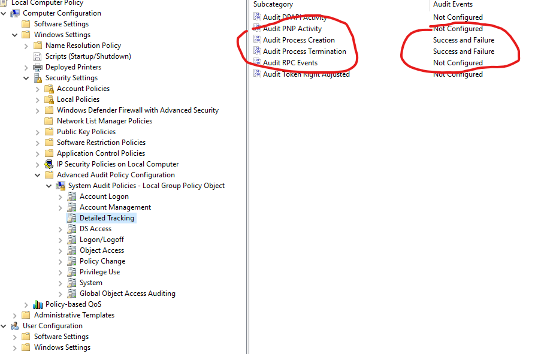
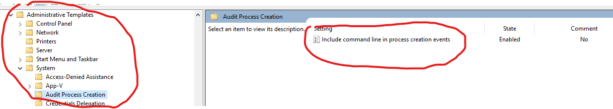

# Windows Event Logging


## Enable Process Auditing 

To enable proceess auditing (advanced audit) you need to set the following policy



To enabled commandline logging along with this  do the following.



You should now have events
* "4688" Process Creation
* "4689" Process Termination

Example

``` xml
- <Event xmlns="http://schemas.microsoft.com/win/2004/08/events/event">
- <System>
  <Provider Name="Microsoft-Windows-Security-Auditing" Guid="{54849625-5478-4994-a5ba-3e3b0328c30d}" /> 
  <EventID>4688</EventID> 
  <Version>2</Version> 
  <Level>0</Level> 
  <Task>13312</Task> 
  <Opcode>0</Opcode> 
  <Keywords>0x8020000000000000</Keywords> 
  <TimeCreated SystemTime="2021-03-20T17:23:35.334603100Z" /> 
  <EventRecordID>18980</EventRecordID> 
  <Correlation /> 
  <Execution ProcessID="4" ThreadID="248" /> 
  <Channel>Security</Channel> 
  <Computer>WIN-NDA8UIVGAA8</Computer> 
  <Security /> 
  </System>
- <EventData>
  <Data Name="SubjectUserSid">S-1-5-21-108682653-446161091-3115200861-500</Data> 
  <Data Name="SubjectUserName">Administrator</Data> 
  <Data Name="SubjectDomainName">WIN-NDA8UIVGAA8</Data> 
  <Data Name="SubjectLogonId">0x51865</Data> 
  <Data Name="NewProcessId">0x1320</Data> 
  <Data Name="NewProcessName">C:\Windows\System32\mmc.exe</Data> 
  <Data Name="TokenElevationType">%%1936</Data> 
  <Data Name="ProcessId">0xeb4</Data> 
  <Data Name="CommandLine">"C:\Windows\system32\mmc.exe" C:\Windows\system32\gpedit.msc</Data> 
  <Data Name="TargetUserSid">S-1-0-0</Data> 
  <Data Name="TargetUserName">-</Data> 
  <Data Name="TargetDomainName">-</Data> 
  <Data Name="TargetLogonId">0x0</Data> 
  <Data Name="ParentProcessName">C:\Windows\explorer.exe</Data> 
  <Data Name="MandatoryLabel">S-1-16-12288</Data> 
  </EventData>
  </Event>
```