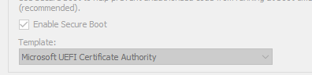

# HyperV stuff

Random notes for myself

## Boot Ubuntu ISOs on hyperv

I noticed the default hyperv gen2 vm uses secure boot. In order to boot ubuntu iso files (For example server builds if you dont want the stock gallery desktop vm), many blogs mentioned disabling secure boot, however Canonical seem to have have signed the image using the MS Cert which works as well if you switch the option to the "UEFI" option.



## Nested Hyper V

* Nested HyperV is currently Intel only unless using Windows Insider.
* You need to turn off dynamic memory when using nested hyperv

To enable Nested hyper VM (per vm)

``` powershell
Set-VMProcessor -VMName "My VM Name" -ExposeVirtualizationExtensions $true
```