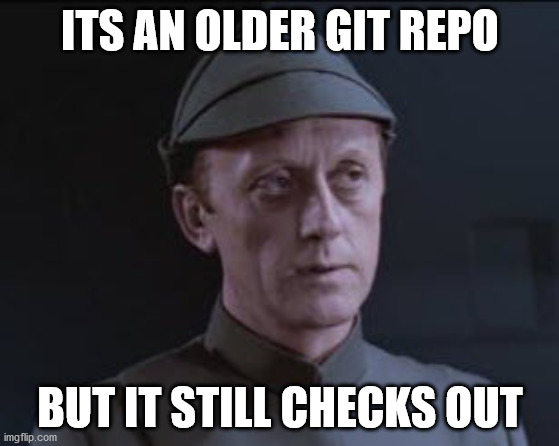
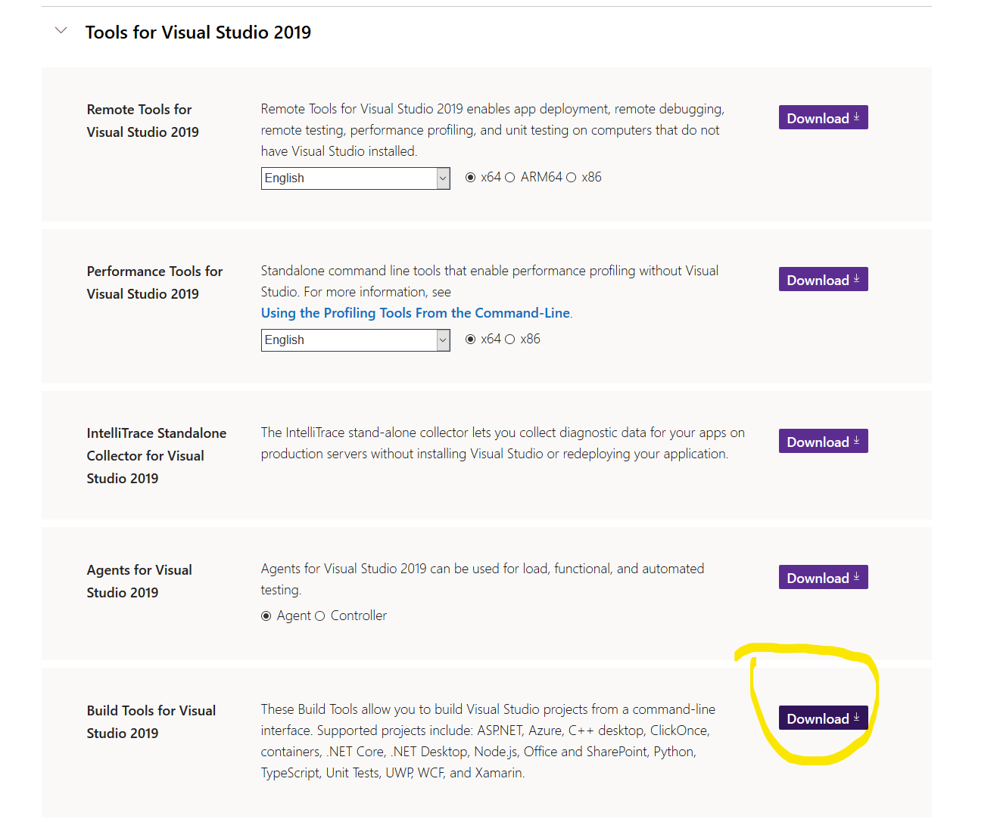
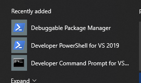
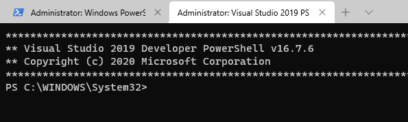
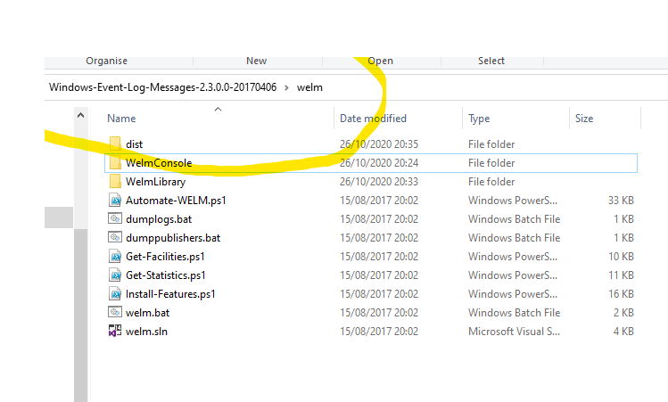
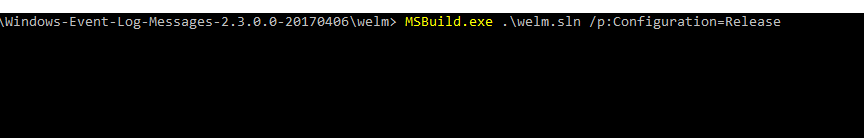
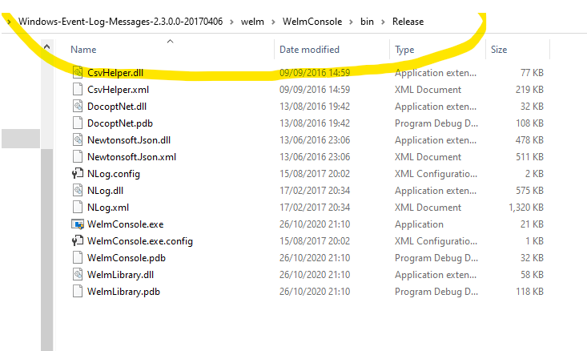
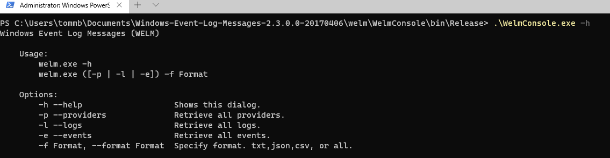
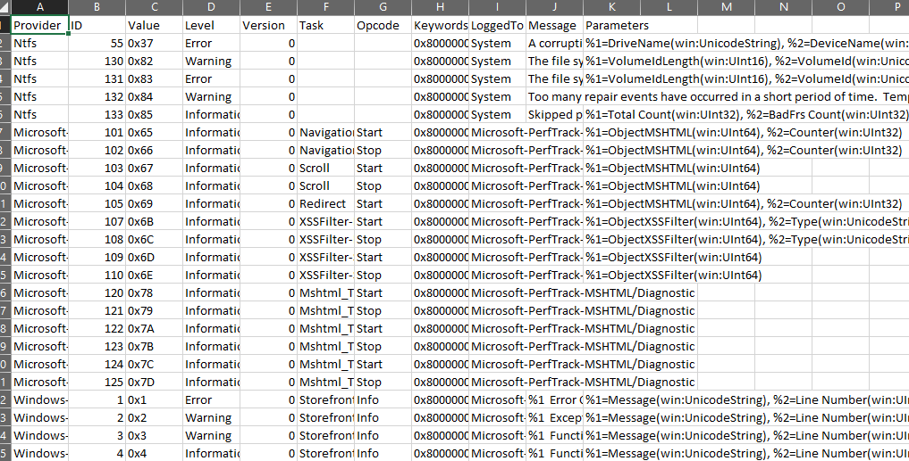

# WELM Usage

## What is WELM

WELM or "[Windows-Event-Log-Messages](https://github.com/nsacyber/Windows-Event-Log-Messages)" is a tool developed by NSACYBER (Snowdens ex) to dump some event/EVT data and strings from a Windows system. This can then be used to enrich log and trace information in analysis platforms in order reconstruct event messages.

> The Windows Event Log Messages (WELM) tool retrieves the definitions of Windows Event Log messages embedded in  binaries. The tool's output can be used to create an exhaustive list of event information for an operating system.

They also published datasets for various operating systems but stopped in 2017 for some reason. Most of the core events are the same however its useful to dump newer builds. **The code hasnt been updated since 2017** but still works today (2020).




The "Official" way to compile it , is via [Visual Studio](https://github.com/nsacyber/Windows-Event-Log-Messages/blob/master/docs/Building%20WELM.md) however I had some concerns on using this because.

* The environment I was working in may have breached the VS community license restrictions , as although welm is opensource (allowed), NSAGOV uses a CC license (why?????) which is not an OSI recognised license (required by MS for OSS + enterprise usage of Visual Studio community).
* Visual Studio is huuuuge (19gb on my test vm) 

This worked on my machine (Win 10 Pro 2004) YMMV.

## Compiling without Visual Studio 

### Install MSbuild and DOTNET

You First need to install the .NET build platform (MSBUILD) , you can use the Visual Studio Tools installer for this. 

Go to [visualstudio.microsoft.com/downloads/](https://visualstudio.microsoft.com/downloads/)

Scroll down to the bit that says "Tools for Visual Studio"



Install the ".Net desktop build tools".


You should now have a special powershell and command prompt for building shiz. 



You can add this to [Windows Terminal](https://devblogs.microsoft.com/commandline/introducing-windows-terminal/) with the following config.

``` json
{
    // Todo set a icon.
    "name": "Visual Studio 2019 PS",
    "commandline": "C:\\Windows\\SysWOW64\\WindowsPowerShell\\v1.0\\powershell.exe -noe -c \"&{Import-Module \"\"\"C:\\Program Files (x86)\\Microsoft Visual Studio\\2019\\BuildTools\\Common7\\Tools\\Microsoft.VisualStudio.DevShell.dll\"\"\"; Enter-VsDevShell e8d3f04a}\"",
    "hidden": false
}
```




### Install Nuget

Now we need nuget to fetch the packages, I found this in the same installer but couldnt find the files once done (no ```updatedb``` and ```locate``` for me on windows). So I just downloaded it from the nuget [site](https://www.nuget.org/downloads) and placed it in ```C:\``` as im super lazy and paths whatever.

### Grab the WELM

Download the latest WELM code from [https://github.com/nsacyber/Windows-Event-Log-Messages/releases](https://github.com/nsacyber/Windows-Event-Log-Messages/releases)

Extract this ZIP and change to the "welm" folder, should look like this



### Install packages with nuget

Now we need to install our packages, There are 2 C# projects ```WelmConsole``` and ```WelmLibrary```. We need to install into a folder called ```Packages``` as thats what our bro Visual Studio would do.

``` powershell
C:\nuget.exe install .\WelmConsole\packages.config  -OutputDirectory Packages
C:\nuget.exe install .\WelmLibrary\packages.config  -OutputDirectory Packages
```

### Build with MSbuild

Now we can press the button, open your special development powershell we got earlier.

Change directory to our welm folder and cast MSbuild against the project file



``` powershell
MSBuild.exe .\welm.sln /p:Configuration=Release
```

You may get some warnings but its not building if you dont get that right???. If you see red you most likely are missing either dontnet4-4.6 SDK or your nuget was wrong.

## live the dream

You will now have a build under ```welm\WelmConsole\bin\Release\```




You can run WELM (dont forget to level up to admin) as described in the project wiki for example to **dump events to csv** 


```WelmConsole.exe -e -f csv```

events.csv produced

